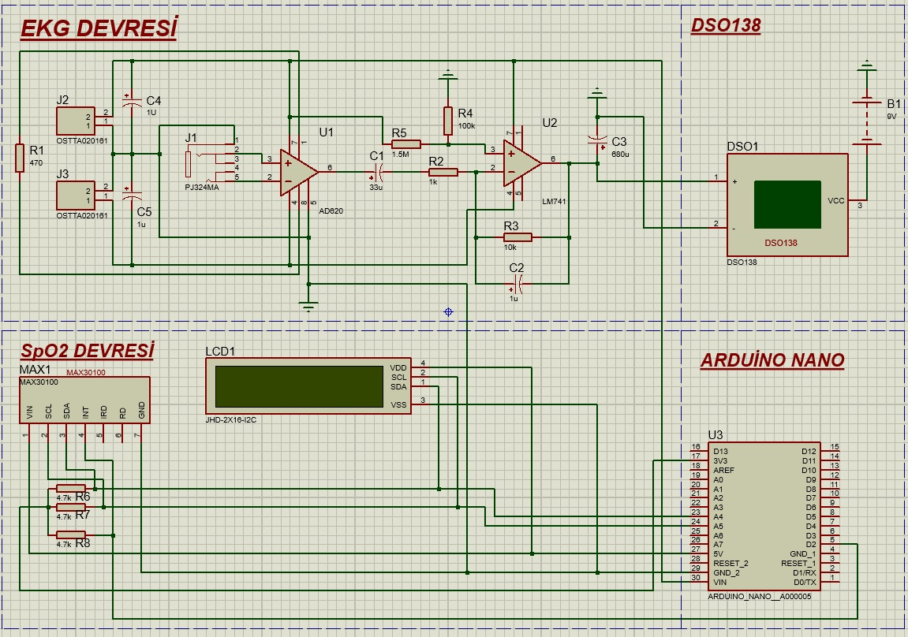

# Taşınabilir EKG ve SpO2 Holter Cihazı Tasarımı

Bu proje, taşınabilir bir EKG ve SpO2 holter cihazının tasarımını, geliştirilmesini ve değerlendirilmesini içermektedir. Bu cihaz, kardiyovasküler sağlığı izlemek ve anlık olarak nabız ve kandaki oksijen yoğunluğunu ölçmek amacıyla tasarlanmıştır.

Bu projede, kardiyovasküler sağlığın izlenmesi ve teşhis edilmesi amacıyla taşınabilir bir EKG ve SpO2 holter cihazı geliştirilmiştir. Bu cihaz, kullanıcıların günlük yaşam aktivitelerini sürdürürken kardiyovasküler sağlıklarını izlemelerini sağlar.

## Özellikler

- Taşınabilir EKG ölçümü
- Anlık nabız ölçümü
- Kandaki oksijen yoğunluğunun (SpO2) ölçülmesi
- Kullanıcı dostu tasarım
- Gerçek zamanlı veri görüntüleme

## Devre Şeması

## Kullanılan Malzemeler

### EKG Devresi için:
- AD620 Enstrümantasyon Yükselteci
- LM741 Opamp
- 9V Pil
- Elektrot ve EKG Kablosu
- 3.5mm Stereo Dişi Jack Girişi
- Kapasitörler ve Dirençler
- DSO138 Osiloskop

### SpO2 Devresi için:
- MAX30100 Sensörü
- Arduino Nano
- 0.91” OLED Ekran

SpO2 için gerekli kütüphaneleri ekleyin. (Adafruit_Sensor, Adafruit_GFX, Adafruit_MAX30100)

## KODLAR

Aşağıda kodların ekran görüntüleri verilmiştir:

## Katkıda Bulunanlar

- Nafiye Melisa ÖZTÜRK
- Beyhan Kadir TURGUT
- Prof. Dr. Mehmet Recep BOZKURT
